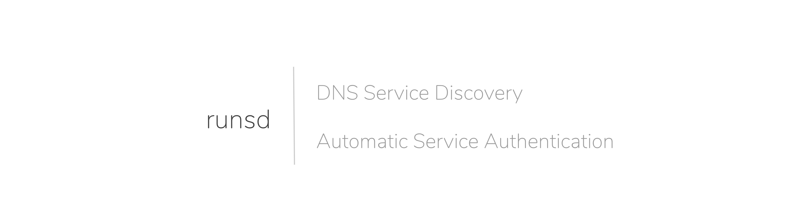
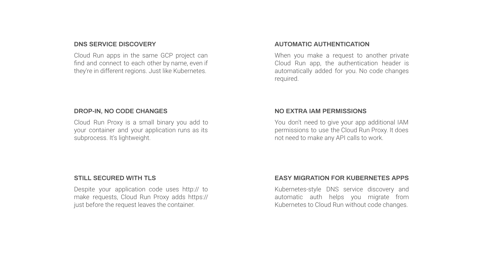
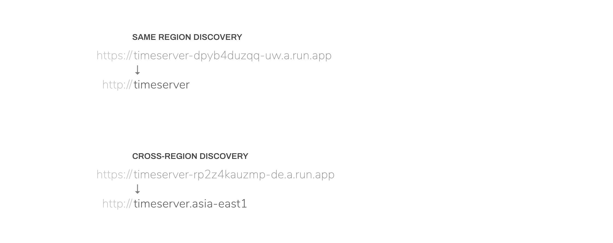
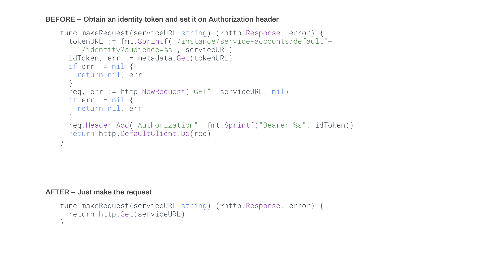
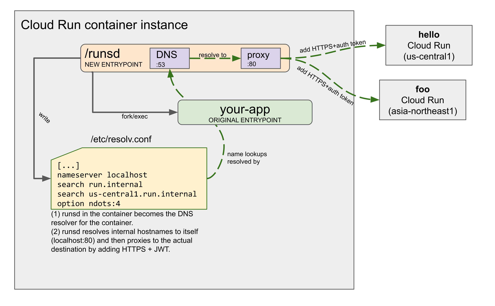

`runsd` is a drop-in binary to your container image that runs on Google [Cloud
Run (fully managed)](https://cloud.run) that allows your services to discover
each other and authenticate automatically without needing to change your code.

It helps you bring existing microservices, for example from Kubernetes, to Cloud
Run. It’s not language-specific and works with external tools and binaries.

> **NOTE:** This project is not a support component of Cloud Run. It's developed
> as a community effort and provided as-is without any guarantees.

<!--
  ⚠️ DO NOT UPDATE THE TABLE OF CONTENTS MANUALLY ️️⚠️
  run `npx markdown-toc -i README.md`.

  Please stick to 80-character line wraps as much as you can.
-->

<!-- toc -->

- [Features](#features)
  * [DNS Service Discovery](#dns-service-discovery)
  * [Automatic Service Authentication](#automatic-service-authentication)
- [Installation](#installation)
- [Quickstart](#quickstart)
- [Architecture](#architecture)
- [Troubleshooting](#troubleshooting)
- [Limitations and Known Issues](#limitations-and-known-issues)

<!-- tocstop -->

## Features

`runsd` does its job in your container, entirely in userspace and does not need
to run with any additional privileges or permissions to work.



### DNS Service Discovery

With `runsd`, other Cloud Run services in the same GCP project can be
resolved as `http://SERVICE_NAME[.REGION[.run.internal]]`:



### Automatic Service Authentication

To develop Cloud Run services that make requests to each other (for
example, microservices), you need to fetch an identity token from the metadata
service and set it as a header on the outbound request.

With `runsd`, this is handled for you out-of-the-box, so you don't need
to change your code when you bring your services to Cloud Run (from other
platforms like Kubernetes) that has name-based DNS resolution:



## Installation

To install `runsd` in your container, you need to download its binary and prefix
your original entrypoint with it.

For example:

```text
ADD https://github.com/ahmetb/runsd/releases/download/<VERSION>/runsd /bin/runsd
RUN chmod +x /bin/runsd
ENTRYPOINT ["runsd", "--", "/app"]
```

In the example above, change `<VERSION>` to a version number in the [Releases
page](https://github.com/ahmetb/runsd).

After installing `runsd`, it will have no effect while running locally. However,
while on Cloud Run, you can now query other services by name over `http://`.

Note that your traffic is still secure –as the request is upgraded to HTTPS
before it leaves your container.

## Quickstart

You can deploy [this](./example) sample application to Cloud Run to try out
querying other **private** Cloud Run services  **without tokens** and **without
full `.run.app` domains** by directly using curl:

```sh
gcloud alpha run deploy curl-app --platform=managed
   --region=us-central1 --allow-unauthenticated --source=example \
   --set-env-vars=CLOUD_RUN_PROJECT_HASH=<HASH>
```

Above, replace `<HASH>` with the random string part of your Cloud Run URLs (e.g.
'dpyb4duzqq' if the URLs for your project are 'foo-dpyb4duzqq-uc.run.app').

This sample app [has](./example/Dockerfile) `runsd` as its entrypoint and it
will show you a form that you can use to query other **private** Cloud Run
services easily with `curl`.

> **Note:** Do not forget to **delete** this service after you try it out, since
> it gives unauthenticated access to your private services.

## Architecture



`runsd` has a rather hacky architecture, but most notably does 4 things:

1. `runsd` is the new entrypoint of your container, and it runs your original
   entrypoint as its subprocess.

1. `runsd` updates `/etc/resolv.conf` of your container with new DNS search
   domains and sends all DNS queries to `localhost:53`.

1. `runsd` runs a DNS server locally inside your container `localhost:53`. This
   resolves internal hostnames to a local proxy server inside the container
   (`localhost:80`) and forwards all other domains to the original DNS resolver.

1. `runsd` runs an HTTP proxy server on port `80` inside the container. This
   server retrieves identity tokens, adds them to the outgoing requests and
   upgrades the connection to HTTPS.

## Troubleshooting

By default `runsd` does not log anything to your application in order to not
confuse you or mess with your log collection setup.

If you need to expose more verbose logs, change the entrypoint in your
Dockerfile from `ENTRYPOINT ["runsd", "--", ...]` to;

    ENTRYPOINT ["runsd", "-v=5", "--", ...]

You can adjust the number based on how much detailed logs you want to see.

If the logs don't help you troubleshoot the issues, feel free to open an issue
on this repository; however, don’t have any expectations about when it will be
resolved. Patch and more tests are always welcome.

## Limitations and Known Issues

1. gRPC does not work as proxy doesn't know how to handle its host header.
1. HTTP protocol corner cases and streaming (SSE or WebSockets) untested.
1. All names like `http://NAME` will resolve to a Cloud Run URL even  if they
   don't exist. Therefore, for example, if `http://hello` doesn't exist, it will
   still be routed to a URL as if it existed, and it will get HTTP 404.
1. Similar to previous item `http://metadata` will be assumed as a Cloud Run
   service instead of [instance metadata
   server](https://cloud.google.com/compute/docs/storing-retrieving-metadata).
   To prevent this, use its FQDN `metadata.google.internal.` with a trailing
   dot.
1. No structured logging support, but this should not impact you since the tools
   is not supposed to log anything except the errors.

-----

This is not an official Google project.
